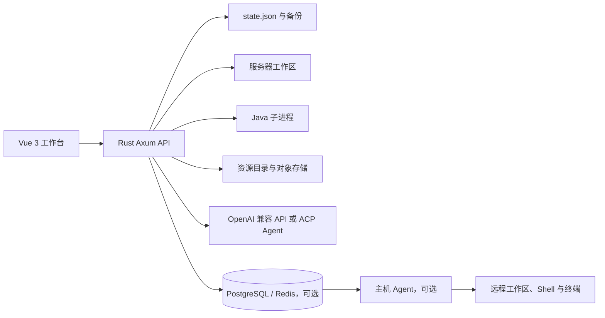

# Sculk Catalyst V3

[](https://github.com/silent-QAQ/sculkcatalystv3/actions/workflows/ci.yml)

Sculk Catalyst V3 是一个 AI 驱动的 Minecraft 服务器工作台。它把服务器创建、Java 环境、核心下载、进程控制、日志与终端、文件管理、资源目录、自动化任务和可选的 Sculk Cloud 主机代理整合到一个 Web 界面中。

项目当前处于“可交互 MVP / 技术验证原型”阶段：本地服务器管理主链路已经可以运行，部分 Cloud、社区运营、MCP 和 AI 自动化能力仍属于局部实现或演示能力。不要把当前版本当作已经完成鉴权、隔离和生产运维加固的公共开服平台。

## 目录

- [项目状态](#项目状态)
- [功能概览](#功能概览)
- [运行架构](#运行架构)
- [环境要求](#环境要求)
- [本地开发](#本地开发)
- [本地生产构建](#本地生产构建)
- [Sculk Cloud 与主机 Agent](#sculk-cloud-与主机-agent)
- [资源中心](#资源中心)
- [配置项](#配置项)
- [测试与 CI](#测试与-ci)
- [目录结构](#目录结构)
- [已知限制与安全边界](#已知限制与安全边界)
- [文档索引](#文档索引)
- [许可证](#许可证)

## 项目状态

最后审计：2026-08-01。

| 模块 | 当前状态 | 已具备能力 | 主要缺口 |
| --- | --- | --- | --- |
| 本地工作台 | 已实现 MVP | 多服务器导航、项目模式、对话树、服务器控制、任务和设置中心 | 桌面端打包、系统托盘和自动升级 |
| 开服向导 | 已实现 MVP | 普通创建、智能规划、Java/端口/磁盘检查、核心选择和工作区生成 | 远程路径创建、完整核心兼容矩阵 |
| 首次初始化 | 已实现 MVP | 持久化 `server_provision` 任务、核心下载与校验、Java 检查、取消、重试和后端重启后重新入队 | 字节级跨重启续传、限速和模板版本管理 |
| 服务器进程 | 部分实现 | 真实 Java 子进程、就绪检测、优雅停止、超时强杀、原子重启、Unix 进程组清理 | 后端重启后不会重新接管已有 Java；Windows 本地工作区仍需继续加固；真实资源指标和崩溃自动恢复 |
| 实时终端 | 已实现 | WebSocket 日志、运行中的 stdin 转发、未运行时明确拒绝、断线回退轮询 | 命令历史、补全、多会话终端 |
| AI 对话 | 部分实现 | OpenAI 格式提供商、模型同步、SSE 流式回复、情景模型、ACP Agent、审核模式 | 模型尚未直接调用文件/终端/服务器工具，暂无完整上下文压缩和用量计费 |
| 自动化任务 | 部分实现 | 风险等级、审批、取消、进度和审计状态 | 通用工具执行器、依赖图、回滚和完整恢复 |
| 资源中心 | 已实现，可独立部署 | 七类资源目录、版本管理、上传、大小与 SHA-256、稳定下载、Range/ETag 静态对象、OpenAPI | 多管理员 RBAC、分页、对象回收和更完整的限流审计 |
| Sculk Cloud | 部分实现 | 账号、团队、设备、设置同步、审批、Token、用量、数据库迁移 | 云资源创建/调度接口仍返回 `501 deployment_planned` |
| 主机 Agent | 部分实现 | 出站配对、指纹确认、心跳、任务租约、Shell、持久终端、checkpoint、取消和重试 | 更细粒度文件/日志/进程权限、租约恢复、审批联动和断线审计 |
| 社区与运营 | 部分实现 | 玩家/反馈/投票/经济模块入口和本地持久化 | RCON/Query/管理插件接入、真实玩家和 TPS 数据 |
| Skills / MCP / 机器人 | 部分实现 | Minecraft 插件 Skill 编译期加载、参考注入、迁移；QQ/NapCat 与评论 webhook 适配器 | 通用 Skill 沙箱、签名、依赖升级、真实 MCP 客户端和更多平台适配 |

能直接验证当前实现细节和路线的状态文档见 [`docs/PROJECT_STATUS.md`](docs/PROJECT_STATUS.md)。

## 功能概览

### 本地服务器工作台

- 多服务器、项目和对话树导航，支持新建、重命名、归档、分叉、删除、搜索和未读状态。
- 四步开服向导：名称与位置、服务器参数、环境检查、确认创建。
- 普通创建会生成独立服务器目录、`server.properties`、`eula.txt`、启动脚本、`plugins` 和 `logs`。
- 智能创建只建立规划项目与“开服规划”对话，不会假装已经下载核心或生成服务器文件。
- 支持启动、停止、重启、状态查询、实时日志、终端命令和文本配置编辑。
- 文件管理器限制在服务器工作区内，拒绝绝对路径、路径穿越、符号链接和二进制核心覆盖。

### 初始化、下载和 Java

- `server_provision` 是持久化任务：后端重启后会把未完成的初始化任务重新放回队列。
- 核心下载支持资源目录优先、多源回退、流式写入 `.part`、文件大小与 SHA-256 校验、取消、失败清理和原子替换。
- 同一服务器的下载与启动互斥，重复初始化请求可以复用已有任务或已安装的非空 `server.jar`。
- 托管 Java 安装使用 Eclipse Adoptium，当前托管安装目标为 Windows x64、Linux x64 和 Linux ARM64，默认版本为 Java 21。
- 已有 Java 的检测顺序为 `SCULK_JAVA_BIN`、项目托管 Java、`JAVA_HOME`、系统 PATH；外部 Java 仍需通过版本和兼容性检查。
- `SCULK_DATA_DIR` 统一控制状态文件、服务器工作区和托管 Java 目录。

初始化任务可以跨后端重启恢复，但这不等于 Minecraft Java 进程恢复：后端重启后不会自动重新接管一个已经在运行的旧 Java 进程。核心下载也不提供跨重启的字节级续传。

### AI、ACP 和自动化

- 支持多个 OpenAI 兼容提供商、模型列表同步、连通性测试和五类情景模型绑定。
- `POST /api/chat/stream` 提供 SSE 流式对话；对话、模型、Agent 和审核模式会持久化。
- 支持内置模型 Agent 与 ACP stdio JSON-RPC Agent；ACP 连接失败时回退到内置模型，再回退到本地规则回复。
- 审核模式包括请求批准、替我审核和完全访问权限；自动化任务提供风险等级、审批、取消、进度和审计状态。
- 当前 AI 对话不会自动执行文件、终端、停服或经济操作，不能把模型回复当成已经完成的服务器变更。

### 资源中心

资源中心统一管理以下资源类型：

- 服务端核心 `core`
- 插件 `plugin`
- 玩家皮肤 `skin`
- Blockbench 模型 `bbmodel`
- UI 贴图 `ui_texture`
- Agent Skill `skill`
- 插件配置 `plugin_config`

它提供项目与版本 CRUD、兼容版本筛选、四级插件优先检索、稳定解析与下载接口、浏览器文件上传、自动生成文件大小和 SHA-256、OpenAPI 3.1 描述，以及可选的独立高带宽对象服务器。插件资源可以检索、管理和下载，但尚未自动安装到服务器 `plugins/`，也没有依赖和冲突解析。

### Sculk Cloud 与主机 Agent

- Cloud 支持账号、团队、邀请、审批、个人 Token、API 凭据、用量、设备和设置同步。
- 主机 Agent 采用出站连接，不要求在开发机或 Minecraft 主机开放入站端口。
- Agent 支持短码配对、指纹确认、心跳、任务租约、结构化工作区操作、Shell、持久终端、检查点、取消、停止、恢复、重试和回滚任务。
- Windows Shell 使用 Job Object，Unix Shell 使用独立进程组清理进程树。
- Agent 的 `full` Shell 权限不是沙箱；命令最终受运行 Agent 的操作系统账号权限约束，Cloud 审批也不等价于文件系统隔离。

## 运行架构



本地模式可以只运行 Rust 后端和前端开发服务器；Cloud 模式额外需要 PostgreSQL 与 Redis；独立资源中心可以把目录 API、Caddy 静态对象和主站前端分开部署。

## 环境要求

基础开发环境：

- Rust 1.88 或兼容的稳定版工具链。
- Node.js 与 npm；CI 使用 Node 24。
- Java 不是启动后端的必需依赖，但创建和运行 Minecraft 服务器时需要 Java 21，或让项目自动准备托管 Java。
- Git。

按场景增加：

- Sculk Cloud：Docker、PostgreSQL、Redis。
- Linux 发布：bash、curl；CI 还会运行 ShellCheck。
- Agent：对应平台的 Rust 编译环境。
- 独立资源中心：Linux 服务环境、HTTPS 反向代理和用于存放对象的磁盘目录。

## 本地开发

### Windows PowerShell

在第一个终端启动后端：

```powershell
Set-Location backend
cargo run
```

在第二个终端启动前端：

```powershell
Set-Location frontend
npm ci
npm run dev
```

打开 <http://127.0.0.1:5173>。Vite 开发服务器默认把 API 请求代理到本地后端；如需调整地址，查看 `frontend/vite.config.ts` 和环境变量示例。

### Linux / macOS shell

```bash
cd backend
cargo run

# 另开终端
cd frontend
npm ci
npm run dev
```

前端入口由路径和构建模式决定：默认路径加载本地工作台，`/resource-admin` 加载资源管理页，`VITE_APP_MODE=cloud` 加载 Cloud 入口。Cloud 前端也可以使用：

```bash
cd frontend
npm run dev:cloud
```

## 本地生产构建

### Linux

```bash
cd backend
CARGO_TARGET_DIR=target-local cargo build --release --locked

cd ../frontend
npm ci
npm run build

cd ..
chmod +x scripts/start-local.sh scripts/stop-local.sh
./scripts/start-local.sh
```

默认访问 <http://127.0.0.1:8787>。脚本使用 `backend/target-local/release/backend`、`frontend/dist` 和 `backend/data`，并在 `.runtime` 写入 PID 与日志。停止服务：

```bash
./scripts/stop-local.sh
```

可以通过第一个参数或 `SCULK_PORT` 修改端口，也可以使用 `SCULK_BACKEND_BIN`、`SCULK_STATIC_DIR` 和 `SCULK_DATA_DIR` 覆盖路径。systemd 模板位于 [`deploy/sculk-catalyst.service`](deploy/sculk-catalyst.service)。

### Windows

```powershell
Set-Location backend
$env:CARGO_TARGET_DIR = 'target-local'
cargo build --release --locked

Set-Location ..\frontend
npm ci
npm run build

Set-Location ..
.\scripts\start-local.ps1
```

Windows 启动脚本默认使用 `backend\target-local\release\backend.exe` 和 `frontend\dist`，启动后访问 <http://127.0.0.1:8787>。停止服务：

```powershell
.\scripts\stop-local.ps1
```

如需保持后端前台等待，可使用 `-KeepAlive`；NapCat 连接可通过 `-NapCatApiUrl` 和 `-NapCatConfigPath` 传入。启动脚本会检查 PID 文件对应的确实是当前后端可执行文件，避免误杀其他进程。

### 健康检查

```text
GET http://127.0.0.1:8787/api/health
```

Linux 启动脚本使用 `/api/health`，Windows 启动脚本使用 `/api/dashboard` 等待服务就绪。API 服务未就绪时脚本会失败并保留错误日志供排查。

## Sculk Cloud 与主机 Agent

### Cloud 本地依赖

复制示例配置并启动 PostgreSQL、Redis：

```powershell
docker compose -f docker-compose.cloud.yml up -d
Copy-Item .env.cloud.example .env
```

至少配置：

```text
DATABASE_URL
REDIS_URL
SCULK_MASTER_KEY
SCULK_CLOUD_PUBLIC_URL
SCULK_ALLOWED_ORIGINS
```

`SCULK_MASTER_KEY` 用于 Cloud 上游凭据加密，生产环境必须替换为独立高熵值；对外部署时必须使用 HTTPS 反向代理，并限制 PostgreSQL、Redis 只允许内网访问。详细的数据库迁移、会话、Token 和部署边界见 [`docs/SCULK_CLOUD.md`](docs/SCULK_CLOUD.md)。

### 构建和运行 Agent

```bash
cd agent
cargo build --release --locked
```

配对示例：

```bash
sculk-agent pair --cloud <https-cloud-url> --code <pairing-code> --name <host-name> \
  --workspace <workspace-label> --workspace-root <path> \
  --permissions full \
  --capabilities heartbeat,tasks-v1,task-checkpoints-v1,shell-v1,terminal-v1
sculk-agent run
```

Agent 默认只向 Cloud 发起 HTTPS 请求。配对码是一次性短时凭据，完成配对后应依赖指纹确认和已保存的 Agent 凭据运行。下载平台、配置文件、权限模型和 Shell 风险见 [`docs/SCULK_AGENT.md`](docs/SCULK_AGENT.md)。

## 资源中心

本地或独立资源中心使用 `.env.resource-center.example` 配置。常见部署文件包括：

- `deploy/Dockerfile.resource-center`
- `deploy/docker-compose.resources.yml`
- `deploy/sculk-resource.service`
- `deploy/sculk-resource-backup.service`
- `deploy/sculk-resource-backup.timer`
- `deploy/Caddyfile.resources`
- `scripts/deploy-resource-center.ps1`

资源管理页路径为 `/resource-admin`。浏览器管理页使用账号密码，自动化客户端使用 Bearer Token；生产环境应使用 HTTPS、精确的 CORS 来源和高熵令牌，不要把源站写接口直接暴露在公网。完整的对象上传、镜像同步、备份和 Caddy 配置见 [`docs/RESOURCE_CENTER.md`](docs/RESOURCE_CENTER.md)。

## 配置项

本地后端最常用的配置如下：

| 变量 | 作用 | 默认或说明 |
| --- | --- | --- |
| `SCULK_BIND_ADDRESS` | 监听地址 | 本地脚本默认 `127.0.0.1:8787` |
| `SCULK_STATIC_DIR` | 前端静态文件目录 | 发布脚本默认 `frontend/dist` |
| `SCULK_DATA_DIR` | 状态、服务器工作区、托管 Java 的统一根目录 | 默认是后端运行目录下的 `data` |
| `SCULK_STATE_FILE` | JSON 状态文件路径 | 默认是 `SCULK_DATA_DIR/state.json` |
| `SCULK_JAVA_BIN` | 指定 Java 可执行文件 | 优先级高于托管 Java、`JAVA_HOME` 和 PATH |
| `SCULK_ALLOWED_ORIGINS` | CORS 允许的前端来源 | 生产环境填写精确来源，不要使用宽泛通配 |
| `SCULK_RESOURCE_API_BASE` | 主站连接的独立资源 API | 未配置时回退到同源 API |
| `DATABASE_URL` / `REDIS_URL` | 启用 Cloud 数据层 | 未同时配置时本地模式仍可运行 |
| `SCULK_MASTER_KEY` | Cloud 上游凭据加密密钥 | 至少 24 字符，生产环境使用独立随机值 |

完整变量名按场景拆分在 `.env.*.example` 中，包括机器人、Cloud、主站资源同步和独立资源中心。真实 `.env`、数据库状态、令牌和运行时密钥不会随项目发布。

## 测试与 CI

本地常用检查：

```bash
cd backend
cargo fmt --check
cargo check --all-targets --locked
cargo clippy --all-targets --locked -- -D warnings
cargo test --all-targets --locked

cd ../agent
cargo check --all-targets --locked

cd ../frontend
npm ci
npm run build
```

仓库内还提供：

- `scripts/test-local-server-provision.ps1`：隔离验证核心下载、初始化、取消、重试和后端重启恢复。
- `scripts/test-cloud-agent-tasks.ps1`：验证 Agent 任务、审批、Shell、checkpoint、恢复、重试和回滚。
- `scripts/test-cloud-terminal-conversations.ps1`：验证 Cloud 终端与对话流程。
- `scripts/cloud-smoke-test.ps1`：Cloud API 冒烟测试。
- `bash -n scripts/*.sh` 与 ShellCheck：Linux 启停脚本检查。

GitHub Actions 工作流见 [`.github/workflows/ci.yml`](.github/workflows/ci.yml)，当前覆盖 Ubuntu/Windows 后端矩阵、Rust 格式化、check、Clippy、测试、Linux shell 检查和 Node 24 前端构建。上述 PowerShell E2E 脚本不是每次 CI 的默认步骤，需要按场景单独运行。

## 目录结构

```text
.
├── backend/       Rust + Axum API、任务执行器、服务器进程、资源目录与 Cloud
├── agent/         独立 Rust 主机 Agent
├── frontend/      Vue 3 + TypeScript + Vite 工作台、Cloud 和资源管理页
├── deploy/        systemd、Docker、Caddy 和资源中心部署模板
├── scripts/       本地启动/停止、Cloud、资源中心和 E2E 脚本
├── docs/          功能状态、架构、Cloud、Agent、资源中心和模板文档
├── artifacts/     可公开的界面截图与测试辅助文件
├── LICENSE        项目主体 Apache License 2.0
├── LICENSES/      受限模块的附加许可证
└── NOTICE         文件范围、署名和第三方声明
```

## 已知限制与安全边界

- 本项目默认面向本机或受信任的内网管理环境；后端默认绑定回环地址，不代表已经具备公网安全模型。
- 本地 JSON 状态会保存服务器、对话、任务和资源目录；本地 AI API Key 在当前版本以明文保存在 `state.json` 及其备份中，应严格限制文件权限。
- Cloud 的上游凭据使用 `SCULK_MASTER_KEY` 加密，但生产环境仍需保护数据库、Redis、会话密钥和反向代理。
- 资源中心有浏览器管理认证和自动化 Bearer Token，但当前没有完整的多管理员 RBAC、限流、对象回收和不可篡改审计；不要直接暴露未加固的写接口。
- Agent 的 `full` Shell 不提供工作区沙箱。审批能限制任务流程，不能替代操作系统权限、容器隔离或专用低权限账号。
- 玩家在线状态、CPU、内存、TPS、经济和反馈部分仍使用本地状态或演示数据；当前没有 RCON、Query 或管理插件的真实同步链路。
- 插件目录可以搜索和下载，但没有自动安装、依赖解析、冲突检查或权限分析。
- Cloud 云资源部署接口当前只提供能力预览和预留路由，创建请求会返回 `501 deployment_planned`，不会创建、计费或调度云资源。
- 外部 MCP、Discord 和监控连接中的部分测试地址仍是演示端点，不表示已经接入真实协议或凭据。

如果发现安全问题，请不要把令牌、数据库导出或真实状态文件提交到 Issue；先移除敏感信息，并通过仓库维护者提供的安全渠道联系项目负责人。

## 文档索引

- [`docs/PROJECT_STATUS.md`](docs/PROJECT_STATUS.md)：按模块记录当前实现、缺口和路线。
- [`docs/FUNCTIONAL_DOCUMENTATION.md`](docs/FUNCTIONAL_DOCUMENTATION.md)：面向功能和用户流程的详细说明。
- [`docs/SCULK_CLOUD.md`](docs/SCULK_CLOUD.md)：Cloud 数据库、会话、Token、加密和部署边界。
- [`docs/SCULK_AGENT.md`](docs/SCULK_AGENT.md)：主机 Agent 的下载、配对、权限、任务和终端。
- [`docs/RESOURCE_CENTER.md`](docs/RESOURCE_CENTER.md)：独立资源中心、对象上传、镜像同步和备份。
- [`docs/BOT_INTEGRATIONS.md`](docs/BOT_INTEGRATIONS.md)：QQ/NapCat、Bilibili、抖音及通用 webhook 适配器。
- [`docs/SERVER_TEMPLATE_MANIFEST.md`](docs/SERVER_TEMPLATE_MANIFEST.md)：可导入的便携开服模板格式。

## 许可证

项目采用分区许可：

- 除特别声明外，项目主体使用 [Apache License 2.0](LICENSE)。
- Sculk Cloud 云账号系统相关文件使用 [`PolyForm Noncommercial License 1.0.0`](LICENSES/PolyForm-Noncommercial-1.0.0.md)，允许范围和限制以该许可证为准。
- 文件范围、署名要求和第三方声明见 [`NOTICE`](NOTICE)。未在 NOTICE 中另行列出的文件适用 Apache License 2.0。

PolyForm Noncommercial 部分属于 source-available，不属于 OSI 定义的开源软件。商业使用 Sculk Cloud 相关受限文件前，请先取得原作者授权。
