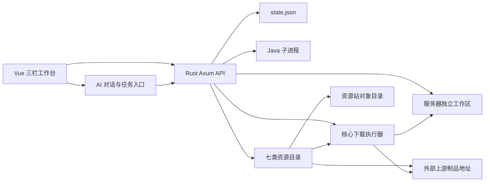

# Sculk Catalyst V3 功能现状与开发路线

> 最后更新：2026-08-01（文件传输、进程树隔离、真实运行指标与 Cloud/Agent 审批闭环）
> 项目阶段：可交互 MVP / 技术验证原型  
> 技术栈：Vue 3 + TypeScript + Vite / Rust + Axum

## 1. 项目目标

Sculk Catalyst V3 是一款 AI 驱动的 Minecraft 服务器全生命周期管理工具，目标是通过对话与可审计自动化完成：

1. 核心与 Minecraft 版本选择。
2. Java 环境检测、安装与切换。
3. 服务器配置、插件与玩法方案生成。
4. 镜像服部署、测试、报错诊断与自动修复。
5. 正式服部署、玩家管理、经济调控与社区运营。
6. 通过 Skills、MCP 和 Codex 扩展代码生成、插件构建及外部服务能力。

当前版本已经覆盖主要界面和业务流程，但部分模块仍使用本地规则或演示数据，尚不能视为生产级开服平台。

## 2. 当前架构

### 2.1 前端

- Vue 3 + TypeScript + Vite。
- Codex 风格三栏布局：服务器导航、AI 对话、工作区。
- 工作区包含控制中心、可独立部署的资源中心、文件管理、终端、AI 自动化、玩家社区、Skills 与 MCP。
- 主要文件：
  - `frontend/src/App.vue`
  - `frontend/src/ResourceAdminApp.vue`
  - `frontend/src/features/mirror/MirrorCenterView.vue`
  - `frontend/src/features/mirror/types.ts`
  - `frontend/src/lib/api.ts`
  - `frontend/src/components/AutomationView.vue`
  - `frontend/src/components/CommunityView.vue`
  - `frontend/src/components/IntegrationsView.vue`

### 2.2 后端

- Rust + Axum 异步 HTTP API。
- Tokio 管理文件、子进程和并发状态。
- 当前使用 `backend/data/state.json` 保存服务器、对话、AI 配置、任务、资源目录、玩家、投票、集成等状态；支持原子提交、上一版本备份、损坏恢复和单写入进程锁。
- 每台服务器拥有独立目录：`backend/data/servers/{server_id}`。
- `backend/src/catalog.rs` 提供核心、四级插件、皮肤、BBModel、UI 贴图、Skill、插件配置目录，项目与版本 CRUD、AI 优先检索、管理令牌鉴权、对象直传、解析、下载及 OpenAPI。
- `backend/src/download.rs` 提供真实核心下载、进度、取消、校验和多源回退。

### 2.3 当前数据流

## 3. 功能状态总览

| 模块 | 状态 | 当前能力 | 主要缺口 |
| --- | --- | --- | --- |
| 三栏工作台 | 已实现 | 多服务器选择、每服多对话任务树、对话分组/固定/归档/分叉/未读、可收起侧栏 | 桌面端窗口与系统托盘 |
| 首次开服向导 | 已实现 | 四步普通创建；Windows x64、Linux x64/ARM64 托管 Java；智能创建仅建立规划项目与对话 | 远程路径执行、核心构建号选择 |
| 服务器工作区初始化 | 已实现 | 创建目录、配置、Windows/Linux 启动脚本；持久 `server_provision` 自动下载校验核心、检查 Java，支持取消、重试和后端重启后安全恢复 | 模板版本管理、字节级跨重启续传 |
| 服务器启停 | 部分实现 | 真实 Child actor、实例代际、就绪检测、安全停止/超时强杀、原子重启、Windows Job Object、Unix 进程组、真实 CPU/RSS 采样 | 后端重启后的进程重连、崩溃自动恢复与退避 |
| 服务器终端 | 已实现 | WebSocket 实时日志、命令真实写入 Java stdin、未运行时明确拒绝 | 命令历史、自动补全、多会话 |
| 文件管理 | 已实现 MVP | 安全目录浏览、文本读取/编辑/保存、新建目录、上传/下载、256 MiB 单文件传输上限、原子写入和核心文件保护 | 移动、复制、删除、差异对比、批量传输 |
| 资源中心 | 已实现（支持独立部署） | 七类资源目录、四级插件优先检索、Skill 自动生成同步、`/resource-admin` 管理页、双层令牌鉴权、浏览器对象直传、自动 SHA-256、解析、Range/ETag 静态下载、远程 API 与 OpenAPI | 多管理员 RBAC、对象回收、分页 |
| 核心下载执行器 | 部分实现 | 目录解析优先、文件大小与 SHA-256 校验、单次运行内 Range 重试、来源回退、取消、安全替换 `server.jar`；首次初始化任务可跨后端重启重新执行 | 字节级跨重启续传、所有来源的可信摘要、下载限速 |
| AI 对话 | 部分实现 | OpenAI 格式提供商接入、SSE 流式输出、每服务器多对话历史持久化、情景模型绑定、快捷切换；规划工作区的确认语可受控派发 `server_bootstrap` 审计任务 | 通用工具调用、跨对话知识库、上下文压缩、token 统计 |
| AI 自动化 | 部分实现 | 本地风险分级、审批、取消、任务队列和三档审核模式；Cloud Agent 另提供团队审批、租约、检查点、重试与回滚 | 本地 AI 工具执行器、依赖图和跨节点恢复 |
| 玩家管理 | 部分实现 | 真实 playerdata 快照、搜索排序、管理资料、等级坐标、背包/末影箱及容器预览、PlaceholderAPI 指定变量 | 实时同步、白名单、权限组、游戏数据写入 |
| 经济运营 | 部分实现 | 总资产与通胀指标、调控任务入口 | 真实流水、物价指数、沙盒模拟与回滚 |
| 玩家意见 | 部分实现 | 反馈列表、分类、情绪与聚类摘要 | 外部渠道采集、真实 AI 聚类、工单流转 |
| 玩法投票 | 已实现（本地） | 创建投票、选项、投票计数、持久化 | 防重复投票、身份校验、Discord/游戏内同步 |
| Skills | 部分实现 | 列表、版本、来源与启停；内置 Minecraft 插件开发 Skill 的编译期加载、按需参考文档注入和旧状态迁移 | 通用 Skill 权限沙箱、签名校验、安装、依赖解析与升级 |
| MCP | 部分实现 | 连接配置展示、启停和模拟延迟测试 | MCP 客户端、鉴权、真实工具发现与调用 |
| Codex 协作 | 概念验证 | UI 状态与交付流程入口 | 真实 MCP 交付、工作树、构建产物和回传 |
| Sculk Cloud 与主机代理 | 部分实现 | 云账号、工作区模板、Windows/Linux 独立 Agent、短期 bootstrap、安全配对、指纹确认、出站心跳、任务租约、团队审批、Shell/终端、检查点、重试/回滚、日志限制与脱敏 | 云资源创建/调度、租约跨重启恢复、断线审计和更细粒度权限 |
| 持久化 | 部分实现 | JSON 原子写入、上一版本备份与恢复、同状态文件独占进程锁 | SQLite、事务、结构化迁移、高并发写入 |
| 安全与审计 | 部分实现 | 高风险审批、路径保护、基础日志 | 登录、RBAC、密钥库、不可篡改审计 |

## 4. 已实现功能

### 4.1 多服务器与控制中心

- 多服务器列表、状态与当前任务展示。
- 每台服务器可建立多个独立对话任务；支持重命名、移动到组、固定、归档、删除、分叉与标记未读。
- 对话历史、模型覆盖与 Agent 覆盖持久化到 `state.json`，切换服务器、切换对话或重启后可恢复；消息最多保留 500 条。
- 服务器项目可从列表删除；选择同时删除磁盘文件时，前端进行两段确认并要求手动输入 `delete all`，后端再次校验确认文本。
- Paper、Purpur、Fabric、Velocity 选项。
- 服务器版本、端口、在线人数、CPU、内存和 TPS 面板。
- 启动、停止、配置、文件和终端入口。
- 状态与任务持久化。

### 4.2 首次开服向导

- 向导拆为四步：名称与位置、服务器参数、环境检查、确认创建。
- 第一步只设置项目名称与位置；本机默认数据目录可直接使用，远程服务器连接已显示为预留选项但暂不可执行。
- 普通创建继续设置核心、版本、最大内存和端口。
- 智能创建只把 `planning` 服务器项目加入列表并创建「开服规划」对话，不预设 Paper 等核心、不创建目录或配置文件；核心选型与部署方案由后续对话决定。
- 最大内存写入服务器状态；Rust 直接启动与生成的 `start.ps1`、`start.sh` 共用相同的 `-Xms/-Xmx` 参数，旧状态默认迁移为 8 GB。
- 打开向导时并行读取系统信息与 `GET /api/catalog/cores`，动态生成核心选项。
- Minecraft 版本来自所选核心聚合后的兼容版本；目录不可用时使用内置回退选项。
- 检测本机 Java、系统架构和数据目录。
- 明示 Minecraft EULA 确认。
- 创建以下内容：
  - `server.properties`
  - `eula.txt`
  - `start.ps1`
  - `start.sh`
  - `plugins/`
  - `logs/`
- 普通创建同时持久化并立即派发 `server_provision`：依次检查工作区与 EULA、解析来源、下载并校验 `server.jar`、检查 Java，成功后才解除启动门禁。
- 初始化进度、事件和错误随任务持久化；可在总览取消或重试。后端中途退出时，同一任务会安全回到队列，已原子安装的核心会直接复用。

### 4.3 资源中心

- 独立的核心、插件、皮肤、BBModel、UI 贴图、Skill 与插件配置库，展示项目资料、预览、许可证、标签、格式、兼容版本、下载量和最新版本。
- 项目与版本均支持创建、读取、更新和删除，输入会校验 slug、版本号、HTTP(S) 下载 URL、SHA-256、发行渠道与发布时间。
- 删除项目时同时删除所属版本；项目 slug 变更时同步迁移版本归属。
- 项目列表支持 `search`、`minecraft`、`channel` 筛选；版本列表支持相同筛选并按发布时间排序。
- 版本状态包含 `draft`、`published` 和 `yanked`，解析与下载只接受 `published` 版本。
- `GET /api/v1/resolve` 按 `kind`、`project`、`minecraft` 和 `channel` 选择最新兼容版本，并返回稳定 `download_path`、文件名、大小与 SHA-256 等元数据。
- 稳定下载路径记录下载次数，并使用 HTTP 307 跳转到版本配置的上游地址。
- 资源中心页面包含 API 快速开始、目录查询、解析调试、下载与错误说明；后端生成 OpenAPI 3.1 JSON。
- 原有镜像源列表和候选 URL 预览仍保留，支持优先级、区域、核心范围以及 `{core}`、`{version}`、`{filename}` 模板变量。

### 4.4 实际核心下载执行器

- 对指定服务器启动独立后台下载任务；下载与 Java 启动共享同服互斥门，拒绝并发重复启动。
- 优先按核心、Minecraft 版本和 stable 渠道解析资源目录中的已发布制品，再按优先级尝试用户选择的有效镜像，最后回退到 Paper/Velocity 的 PaperMC API 或 PurpurMC API 官方源。
- `example.com` 预留镜像不会进入真实执行队列；目录没有合格制品时自动走后续来源。
- 流式写入 `data/servers/{id}/server.jar.part`，持续更新来源、已收字节、总字节和百分比。
- 下载过程中同步计算 SHA-256；目录制品同时校验记录的文件大小与可信摘要，失败时删除临时文件并尝试下一来源。
- 成功后先保留旧核心的回滚路径，再将临时文件替换为 `server.jar`；安装失败会恢复旧核心。完成后同步目录下载计数、`server_provision`/`download` 任务、服务器状态与日志。
- 支持取消；取消或来源失败会清理临时文件，所有来源失败后任务进入 `failed`。
- 当前不是字节级跨重启断点续传：重新下载会从头开始。普通创建的初始化任务可跨后端重启恢复到安全阶段，手工下载任务的活动传输状态不会恢复。

### 4.5 安全文件管理

- 浏览服务器根目录和嵌套目录。
- 读取与保存 UTF-8 文本文件。
- 支持 properties、YAML、JSON、TOML、INI、Markdown、Shell、PowerShell 和日志。
- 新建目录。
- 文本编辑单文件上限约 2 MB；独立上传/下载接口单文件上限 256 MiB。
- 上传使用临时文件 + 原子重命名，默认不覆盖既有文件。
- 根目录的 `server.jar`、`server.jar.part` 和 `server.jar.backup` 受保护，不能通过文件管理接口覆盖、删除或改名。
- 下载响应会清理文件名和 `Content-Disposition`，路径仍必须位于服务器工作区内。
- 拒绝：
  - 绝对路径。
  - `..` 路径穿越。
  - 符号链接。
  - 二进制文件编辑。
  - `server.jar` 覆盖。

### 4.6 自动化与审批

- 创建诊断、备份、经济调控和部署任务。
- 低、中、高风险分级。
- 低风险任务可自动进入运行状态。
- 中高风险任务等待人工批准。
- 支持批准、取消、进度和状态记录。
- Cloud Agent 的 high/critical 任务与持久终端必须绑定 `team_id` 和唯一审批记录；请求人不能自批，只有团队 owner/admin/approver 可以决定。
- 重试和回滚会创建新的任务与新的审批，不复用旧决定；旧版本没有可验证审批关联的未启动高风险任务/终端会话会在迁移时取消。

### 4.7 玩家与社区

- 玩家在线状态、身份、资产、游戏时长和延迟。
- 玩家警告、踢出、封禁操作预览。
- 玩家反馈分类、情绪和聚类摘要。
- 玩法投票创建与计票。
- 经济总资产和通胀指标面板。

### 4.8 Skills 与 MCP

- Skills 名称、版本、来源、描述与启停。
- MCP 端点、状态、能力列表和启停。
- 连接测试与模拟延迟。
- Codex、Discord 和监控网关演示配置。

### 4.9 AI 模型接入与审核模式

- 模型提供商管理：接入任意 OpenAI 格式 API 或自定义中转服务（base_url + api_key），支持多提供商并存；同名模型以 `(provider_id, model_id)` 二元组区分，允许两家中转站提供同一模型。
- 从上游 `GET /v1/models` 同步模型列表（保留已启用标记，新模型默认关闭），逐模型 "hi" 连通性测试返回延迟与回复片段。
- 设置页（左侧栏「设置」）：提供商 CRUD、启停、模型同步与启用、hi 测试、情景模型绑定、审核模式切换。
- 情景绑定：对话、管理/自动化、开服向导、配置编写、社区分析五个情景各自可绑定模型，未绑定回退默认模型；默认模型未设置时回退本地规则回复。
- 对话流式输出：`POST /api/chat/stream` SSE 端点，转发上游流式增量（打字机效果）；上游失败或无提供商时自动回退本地规则（同样以流式分片发出，带「本地规则」角标）。
- 对话栏 composer：Agent、模型与审核模式三个独立快捷选择器；模型和 Agent 选择按对话保存，模型可覆盖情景绑定。
- 审核模式（全局持久化）：「请求批准」中高风险任务需人工批准；「替我审核」AI 自动批准中风险（任务记 `approved_by: ai`），高风险仍需人工；「完全访问权限」所有任务自动执行（记 `approved_by: auto`）。
- API Key 仅明文保存在本地 `state.json`，所有 API 响应只返回脱敏形式（`****` + 末 4 位）；编辑时留空表示不修改。

### 4.10 ACP Agent 接入

- 通过 ACP 协议（Agent Client Protocol，stdio JSON-RPC 按行分帧）接入外部 Agent：预设 Codex CLI、Claude Code CLI、OpenClaw、Hermes 类型，另支持任意自定义命令。
- Agent CRUD、启停、握手测试（`initialize` 往返，返回协议版本与延迟）。
- 可将任一 Agent 设为默认对话 Agent；对话栏将 Agent、模型与审核模式拆为独立快捷选择器，选择按对话持久化；ACP Agent 启用时隐藏不生效的直连模型选择。
- Agent 对话走 `session/new` + `session/prompt`，`session/update` 的 `agent_message_chunk` 转为 SSE delta 流式转发。
- Agent 发来的 `session/request_permission` 在所有审核模式下均明确取消；文件读写等其他反向请求一律拒绝（当前不授予 Agent 工作区权限）。
- Agent 启动失败或握手失败时自动回退内置模型直连 → 本地规则，链路不中断。

## 5. 后端 API 概览

### 5.1 基础与服务器

- `GET /api/health`
- `GET /api/dashboard`
- `POST /api/chat`
- `GET /api/system`
- `POST /api/servers`
- `POST /api/servers/{id}/provision`（首次初始化的幂等读取与失败后重试）
- `POST /api/servers/plan`（智能创建：仅建立规划项目和初始对话，不写服务器文件）
- `DELETE /api/servers/{id}`（可选删除磁盘文件；删除文件需确认文本 `delete all`）
- `POST /api/servers/{id}/action`
- `POST /api/servers/{id}/command`
- `GET|PUT /api/servers/{id}/config`
- `GET /api/servers/{id}/logs`
- `GET /api/servers/{id}/ws/logs`（WebSocket 实时日志）
- `GET|POST /api/servers/{id}/conversations`
- `GET|PUT|DELETE /api/conversations/{id}`
- `POST /api/conversations/{id}/fork`

### 5.2 文件管理

- `GET /api/servers/{id}/files`
- `GET|PUT /api/servers/{id}/file`
- `POST /api/servers/{id}/directory`

### 5.3 镜像资源目录

- `GET /api/catalog/summary`
- `GET|POST /api/catalog/cores`
- `GET|PUT|DELETE /api/catalog/cores/{slug}`
- `GET|POST /api/catalog/cores/{slug}/versions`
- `GET|PUT|DELETE /api/catalog/cores/{slug}/versions/{version}`
- `GET|POST /api/catalog/plugins`
- `GET|PUT|DELETE /api/catalog/plugins/{slug}`
- `GET|POST /api/catalog/plugins/{slug}/versions`
- `GET|PUT|DELETE /api/catalog/plugins/{slug}/versions/{version}`
- `GET /api/v1/resolve?kind={core|plugin|skin|bbmodel|ui_texture}&project={slug}&minecraft={version}&channel={channel}`
- `GET /api/v1/download/{kind}/{project}/{version}`（HTTP 307 上游跳转）
- `GET /api/openapi.json`

项目和版本列表接受可选的 `search`、`minecraft`、`channel` 查询参数。

### 5.4 镜像选择与核心下载

- `GET /api/download/mirrors`
- `POST /api/download/preview`
- `POST /api/servers/{id}/download/core`
- `GET /api/servers/{id}/download/status`
- `POST /api/servers/{id}/download/cancel`

### 5.5 自动化

- `GET /api/automation`
- `POST /api/automation/tasks`
- `POST /api/tasks/{id}/approve`
- `POST /api/tasks/{id}/cancel`

### 5.6 社区

- `GET /api/community`
- `POST /api/polls`
- `POST /api/polls/{id}/vote`
- `POST /api/feedback/cluster`
- `POST /api/players/{id}/action`

### 5.7 扩展能力

- `GET /api/integrations`
- `POST /api/integrations/{id}/toggle`
- `POST /api/integrations/{id}/test`
- `POST /api/skills/{id}/toggle`

### 5.8 AI 模型接入

- `GET /api/ai/settings`（提供商、情景绑定、默认模型与审核模式全量视图，密钥脱敏）
- `POST /api/ai/providers` / `PUT|DELETE /api/ai/providers/{id}`（删除时级联清理情景绑定）
- `POST /api/ai/providers/{id}/models/sync`（拉取上游 `/v1/models`）
- `POST /api/ai/providers/{id}/models/toggle`（body 传 `model_id`，兼容含 `/` 的模型名）
- `POST /api/ai/test`（对指定 provider+model 发送 "hi" 测试，返回延迟与回复）
- `PUT /api/ai/scenarios`（五情景 + `default` 绑定/清除）
- `PUT /api/ai/review-mode`（approval / auto / full）
- `POST /api/ai/agents` / `PUT|DELETE /api/ai/agents/{id}`（ACP Agent 接入配置）
- `POST /api/ai/agents/{id}/test`（ACP initialize 握手测试）
- `PUT /api/ai/agents/active`（设置/清除默认对话 Agent）
- `PUT /api/conversations/{id}/execution`（保存该对话的模型与 Agent 覆盖）
- `POST /api/chat/stream`（SSE：meta / delta / error / done 事件，携带任务信息；支持 `model_override` 与 `agent_override`）

## 6. 已知限制与技术债

### 6.1 后端与运行时

- 同一 JSON 状态文件已有独占进程锁，第二个后端会拒绝启动；仍不适合横向扩容、高并发写入和事务场景。
- 后端重启后不能重新关联已经运行的 Java 进程。
- 服务器进程的 CPU 百分比与 RSS 内存已经从真实子进程采样，并按当前进程代际写回；TPS、在线玩家、经济和反馈数据仍主要是本地状态或演示值。
- 高频日志输出时每行都会触发一次 state.json 全量写盘，需要节流或迁移 SQLite。
- 活动下载状态与取消标记只保存在内存中；普通创建的持久初始化任务会在重启后重新执行安全阶段，但不能续接已接收字节，手工下载任务也不会恢复。

### 6.2 AI

- 已接入 OpenAI 格式提供商与 SSE 流式对话；意图分类与任务创建仍使用本地关键词规则，模型回复不影响任务判定。
- 本地对话尚未直接调用文件、终端、任务或镜像服工具；仅规划工作区中的明确确认语会经本地规则创建 `server_bootstrap` 任务，并继续受审核模式、下载校验与启动审计约束。Cloud Agent 是独立的远程执行链，已具备任务租约、团队审批和持久终端，不应与本地 AI 对话能力混同。
- 每个对话的完整历史已后端持久化，模型请求仍只携带最近 20 条；尚未建立跨对话服务器知识库、摘要记忆与上下文压缩。
- API Key 在 `state.json` 与上一版本 `.bak` 中明文存储（API 响应已脱敏），未实现密钥加密与凭证轮换。
- 未实现 token 统计、用量计费与限流。
- 自动修复、配置生成、玩法设计和宣传文案尚未由真实模型驱动执行。

### 6.3 Minecraft 集成

- 未接入 RCON、Query、插件消息或代理网络 API。
- 插件已支持目录检索、版本筛选和重定向下载，但未自动安装到服务器 `plugins/`，也没有依赖、冲突或权限解析。
- Minecraft 版本与 loader 兼容性目前依赖管理员录入的元数据，只做筛选，不构成经过验证的兼容矩阵。
- 未实现世界备份、恢复、克隆和镜像服差异同步。
- Paper、Velocity 与 Purpur 已有官方源解析路径；Fabric Loader 的安装器与 loader bootstrap 尚未实现。

### 6.4 镜像资源与下载

- 资源中心保存元数据和源站 `download_url`，下载端点返回 HTTP 307；已提供浏览器对象上传、独立高带宽源站与静态对象目录示例，Rust 主 API 仍不代理大文件，副本管理和对象回收尚未完成。
- 重定向下载不提供 Range、ETag、缓存协商或断点续传；下载计数表示稳定入口被请求，不代表上游文件一定成功传输。
- 核心下载器使用 `server.jar.part`，失败或取消后会清理临时文件，重试会从头开始；首次初始化任务已有跨重启安全重放，仍无暂停、字节级恢复或限速。
- 下载器始终计算 SHA-256，但仅当来源提供可信预期摘要时执行一致性校验；模板镜像和 Purpur 官方源当前可能只有计算与日志记录。
- 开服器下载执行器已复用资源目录的版本解析规则并消费目录中的可信 SHA-256；自定义镜像和部分官方源仍可能只能记录实际摘要，无法做预期摘要比对。
- 目录 CRUD 和下载接口没有登录、API Key、RBAC、限流或操作审计，仅适用于本机可信环境。
- 目录保存在单个 JSON 状态文件中，没有分页、事务、并发写入控制和历史版本审计。

### 6.5 外部系统

- MCP 连接测试为演示状态，不是真实 MCP 协议握手。
- Discord、监控和 Codex 端点为示例地址。
- 未实现 OAuth、API Key 密钥托管和凭证轮换。

### 6.6 产品与安全

- 本地控制 API 仍无用户登录、权限角色和多租户隔离；Cloud API 具备账号、团队角色和审批权限，但尚未完成完整多租户治理。
- 无 CSRF、限流和系统级操作授权。
- 本地审计日志尚不可防篡改；Cloud Agent 任务/审批事件可追踪，但仍需外部不可篡改审计存储。
- 未实现桌面端自动升级、系统托盘和开机启动。

## 7. 待开发项

### P0：形成可真实开服的闭环

1. **SQLite 持久化**
   - 服务器、任务、审批、玩家、投票、日志索引和集成配置迁移到 SQLite。
   - 数据库迁移、事务、备份和恢复。

2. **Java 运行时管理**
   - Java 版本解析与兼容规则。
   - Adoptium 或自建镜像下载接口。
   - 安装、校验、切换和每服绑定。

3. **镜像资源与核心下载（MVP 已落地，待加固）**
   - 已完成核心/插件项目与版本 CRUD、筛选、版本解析、稳定下载入口和 OpenAPI。
   - 已完成核心流式下载、临时文件、进度、取消、SHA-256 计算、条件校验和来源失败回退。
   - ~~将核心执行器改为直接消费资源目录解析结果和目录中的可信 SHA-256。~~（已完成：目录优先、大小/SHA-256 校验、成功计数与安全替换）
   - 补充镜像源 CRUD、健康检查、测速、对象存储、Range/ETag 和断点续传。
   - 持久化下载任务，支持暂停、恢复、重启接续、限速与失败重试策略。

4. **可靠进程管理**
    - 已完成每服最大内存与 JVM 堆参数持久化、Windows Job Object、Unix 进程组和真实 CPU/RSS 采样；待补每服 PID、完整启动参数和后端重启后的运行状态恢复。
   - 崩溃识别、自动重启和退避策略。
   - 优雅关服超时处理与强制终止回退。
   - ~~命令真实转发、日志流~~（已完成：WebSocket 日志 + stdin 转发）

5. **真实 AI Agent（对话链路已落地，待补工具调用）**
   - ~~模型提供商配置。~~（已完成：OpenAI 格式多提供商、模型同步、hi 测试、情景绑定）
   - ~~流式对话。~~（已完成：SSE 流式 + 本地规则回退）
    - 工具权限、审批和审计（本地审核模式三档已落地；Cloud Agent 已有独立团队审批执行链）。
   - 文件、终端、任务、镜像服和 Codex 工具调用。

6. **基础安全**
   - 本地管理员登录。
   - 凭证加密存储。
   - 操作权限与不可绕过的审批门。

### P1：完成插件与测试服工作流

1. 将已完成的插件目录搜索、版本选择和稳定下载入口接入服务器 `plugins/` 安装流程。
2. 插件依赖、冲突、权限风险和 Minecraft 版本兼容检查。
3. 插件配置 Schema、AI 生成、Diff 和回滚。
4. 世界备份、恢复、克隆和镜像服生成。
5. 镜像服自动启动、测试脚本和结果报告。
6. Codex MCP 真实交付：需求文档、代码、构建、测试、产物回传。
7. 插件灰度部署、玩家邀请和正式服实装审批。
8. RCON/Query 或管理插件接入，获取真实玩家和性能数据。

### P2：社区运营与产品化

1. Discord、QQ、网页和游戏内反馈采集。
2. 投票身份校验、渠道同步和防重复投票。
3. 经济流水、物价指数、贫富差距和调控沙盒。
4. 宣传文案、活动公告和短视频脚本生成。
5. 多用户、RBAC、多租户与远程管理。
6. Tauri 2 桌面端、系统托盘、自动升级和崩溃报告。
7. 插件化 Skills 安装、升级、签名和沙箱。
8. 可观测性、告警、性能基线和历史趋势。

## 8. 建议里程碑

### M1：真实单服可用

- SQLite、Java 管理、核心下载可靠性与进程管理。
- 真实终端和实时日志。
- 单机管理员安全模型。

### M2：AI 开服闭环

- 真实模型、工具调用和审批。
- 配置生成、诊断、修复和回滚。
- 插件安装、依赖分析和镜像服测试。

### M3：Codex 与插件研发闭环

- MCP 交付插件需求。
- 自动构建、测试、产物管理与灰度部署。
- 正式服实装审批与回滚。

### M4：社区运营闭环

- 玩家数据、经济、意见、投票和宣传内容。
- Discord/游戏内渠道同步。
- 运营报告与策略效果追踪。

### M5：桌面产品化

- Tauri 打包、安装器、自动升级和系统托盘。
- 完整权限、审计、密钥和备份机制。

## 9. 下一阶段建议

建议下一阶段优先完成 **SQLite + Java 管理 + 下载链路加固**（镜像资源中心、目录到核心执行器的可信下载链、WebSocket 日志已完成）。下载链路接下来应补齐断点续传、状态恢复、镜像健康检查与失败重试策略；随后再接入插件安装与依赖分析。

## 10. 验收基线

项目进入可公开测试阶段前，至少应满足：

- 能在全新 Windows x64、Linux x64 或 Linux ARM64 环境自动准备兼容 Java。
- 能通过用户配置的镜像下载并校验 Paper/Purpur 核心。
- 能创建、启动、停止、重启并恢复服务器状态。
- 终端命令和日志为真实数据。
- 配置变更具备 Diff、审批、备份和回滚。
- AI 无法绕过高风险审批。
- 凭证不以明文出现在日志、状态文件和前端响应中。
- 后端异常退出后不会遗留失控 Java 进程。
- 核心流程具备自动化测试和可复现错误报告。
